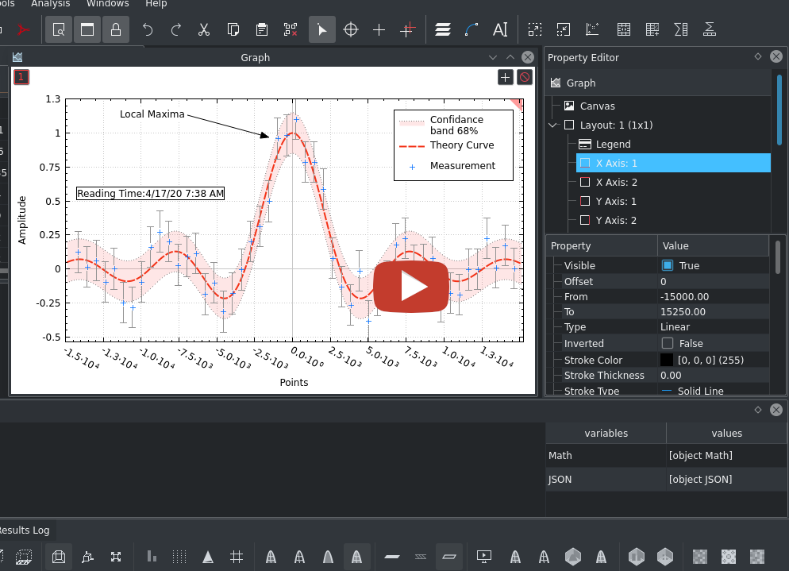
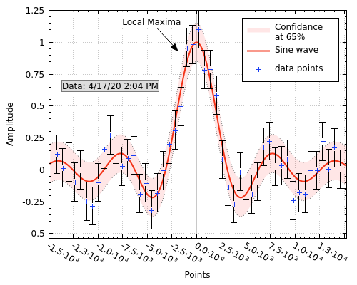
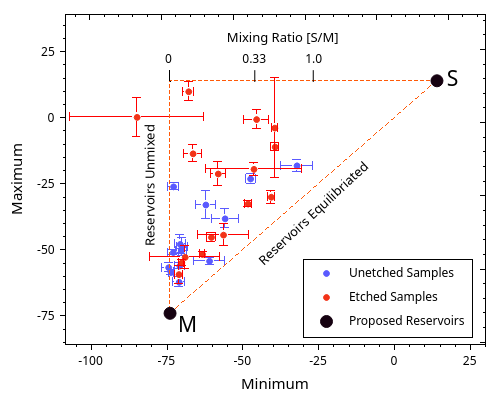
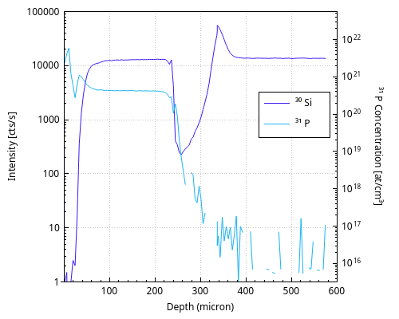
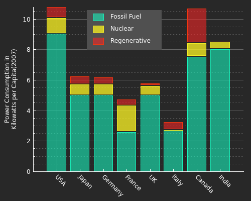
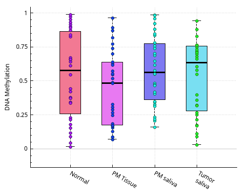
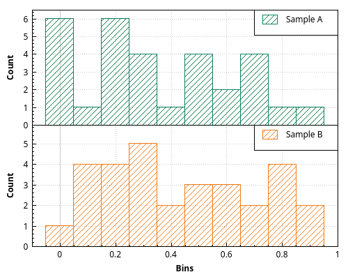
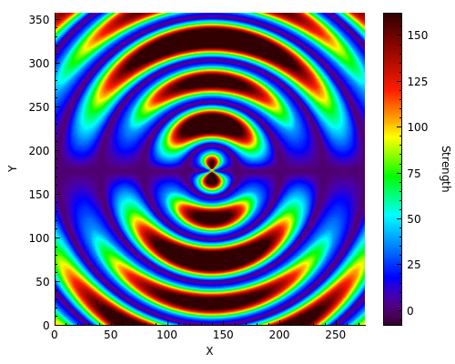
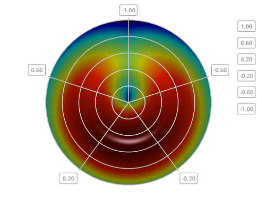
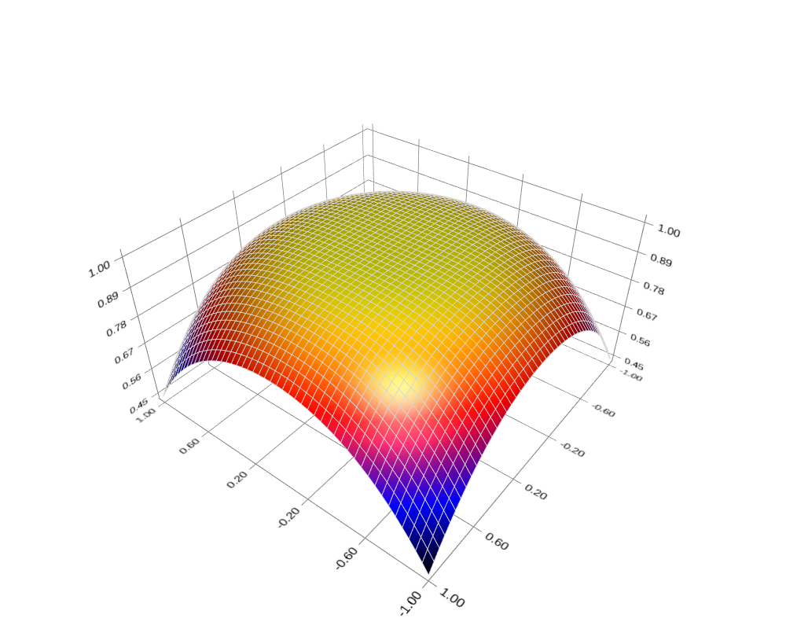

[![License][license-badge]][license-page]  [](https://gitter.im/narunlifescience/LabRPS?utm_source=badge&utm_medium=badge&utm_campaign=pr-badge&utm_content=badge)
[](https://sourceforge.net/projects/labrps/files/latest/download) [](https://sourceforge.net/projects/labrps/files/latest/download) [](https://sourceforge.net/projects/labrps/files/latest/download) [](https://sourceforge.net/projects/labrps/files/latest/download)

[license-page]: COPYING
[license-badge]: http://img.shields.io/badge/License-GPL2-blue.svg

Alpha Plot is a free application for <i>Sci</i>entific <i>D</i>ata <i>A</i>nalysis and <i>Vis</i>ualization for Windows, Linux and Mac OS X (probably BSD also).

| Web         | Link                                             |
|:------------|:-------------------------------------------------|
| Website     | https://labrps.sourceforge.io/                |
| Wiki        | https://labrps.sourceforge.io/wiki                |
| Github      | https://github.com/narunlifescience/LabRPS    |
| Sourceforge | https://sourceforge.net/projects/labrps/      |
| Test builds | https://labrps.sourceforge.io/test-build.html |

[](https://repology.org/project/labrps/versions)
<a href='https://flathub.org/apps/details/io.github.narunlifescience.LabRPS'></a>

# Donate
LabRPS is an open-source project that has been made possible due to the generous contributions by community backers. If you are interested in supporting this project, please consider becoming a sponsor or becoming a patron https://www.patreon.com/labrps

# Watch the Video
[](http://www.youtube.com/watch?v=U3DE_ObVLeU "LabRPS Plotting Basics")

# Examples
| | | |
|:-------------------------:|:-------------------------:|:-------------------------:|
||  ||
||  ||
||  ||

# Installation
Get the code (if you haven't already):

    git clone https://github.com/narunlifescience/LabRPS.git 

Compile and install:

    qmake
    make 
    sudo make install

For Windows/OSX see [installation notes](data/INSTALL.md)

Opening an issue
----------------
### Ask for a new feature

Please:

 * Check if the new feature is not already implemented (Changelog)
 * Check if another person didn't already open an issue
 * If there is already an opened issue, there is no need to comment unless you have more information, it won't help. Instead, you can click on :thumbsup: and subscribe to the issue to be notified of anything new about it 

### Report a bug

Please:
 
 * Try the latest developer build to see if the bug is still present (**Attention**, those builds aren't stable so they might not work well and could sometimes break things like user settings). If it works like a charm even though you see an open issue, please comment on it and explain that the issue has been fixed
 * Check if another person has already opened the same issue to avoid duplicates
 * If there already is an open issue you could comment on it to add precisions about the problem or confirm it
 * In case there isn't, you can open a new issue with an explicit title and as much information as possible (OS, Alpha Plot version, how to reproduce the problem...)
 * Please use http://pastebin.com/ for logs/debug
 
If there are no answers, it doesn't mean we don't care about your feature request/bug. It just means we can't reproduce the bug or haven't had time to implement it :smiley:

## Dependencies

LabRPS may require the following packages ...

| Package       | Link                                         |
|:--------------|:---------------------------------------------|
| Qt            | https://www.qt.io/                           |
| QCustomPlot   | https://www.qcustomplot.com/                 |
| muParser      | http://muparser.beltoforion.de/              |
| GSL           | http://www.gnu.org/software/gsl/             |

Out of this, QCustomPlot and muParser sources(s) are already present in 3rdparty folder and will be statically built to LabRPS. So these packages need not be installed on your system.

Note: LabRPS uses QtDataVisualization module for 3D plotting. You may have to install its equivalent manually if the build fails with the following ERROR: Unknown module(s) in QT: datavisualization. If you are building with a local Qt installation, you may install the module with Qt maintenance tool.

# Credits

## Author

- **Arun Narayanankutty**

## Packagers

The following people have made installing LabRPS easier by providing specialized binary packages.
In alphabetical order.

- [Filipe](https://github.com/filipestevao) ([Flatpak stable](https://flathub.org/apps/details/io.github.narunlifescience.LabRPS) / [Flatpak beta](https://github.com/narunlifescience/LabRPS/issues/20#issuecomment-808984764))
- [devacom](https://github.com/devacom) ([Ubuntu package](https://launchpad.net/~devacom/+archive/ubuntu/science))

```
sudo add-apt-repository ppa:devacom/science
sudo apt-get update
sudo apt install labrps
```

## SciDAVis & QtiPlot Developers

LabRPS is a fork of SciDAVis(at the time of the fork, i.e. SciDAVis 1.D009) which in turn is a fork of QtiPlot(at the time of the fork, i.e. QtiPlot 0.9-rc2). The following people have written parts of the SciDAVis & QtiPlot source code, ranging from a few lines to large chunks(in alphabetical order).

- Tilman Benkert,
- Shen Chen,
- Borries Demeler,
- José Antonio Lorenzo Fernández,
- Knut Franke,
- Miquel Garriga,
- Vasileios Gkanis,
- Gudjon Gudjonsson,
- Alex Kargovsky,
- Michael Mac-Vicar,
- **Arun Narayanankutty,**
- Tomomasa Ohkubo,
- Russell Standish,
- Aaron Van Tassle,
- Branimir Vasilic,
- Ion Vasilief,
- Vincent Wagelaar


The LabRPS manual is based on the QtiPlot and SciDAVis manual, written by(in alphabetical order):

- Knut Franke, 
- Roger Gadiou, 
- Ion Vasilief

We thank all the tools and library developers & contributors used by LabRPS(in no particular order):

- Qt (https://www.qt.io/),
- Qt Creator (https://www.qt.io/product/development-tools),
- QCustomPlot (https://www.qcustomplot.com/),
- muParser (https://beltoforion.de/en/muparser/),
- Sublime Text editor (https://www.sublimetext.com/),
- GSL (http://www.gnu.org/software/gsl/),
- Git (https://git-scm.com/),
- Breeze Icons (https://github.com/KDE/breeze-icons),
- Inno Setup (https://jrsoftware.org/isinfo.php),
- Flatpak (https://flatpak.org/)

... and many more we just forgot to mention.
