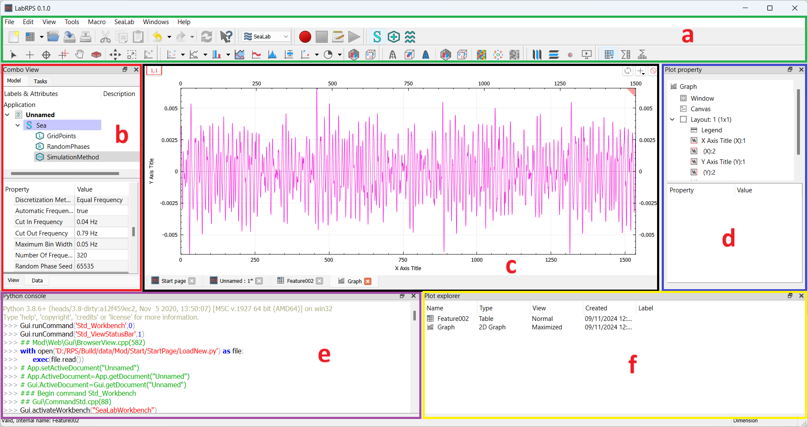
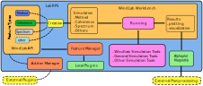
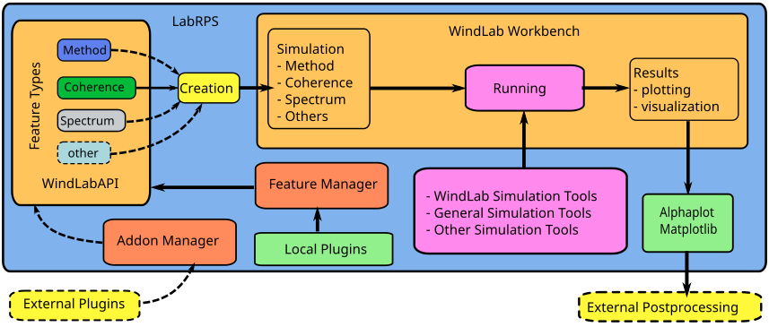

# Summary

LabRPS is an open-source computational tool designed for the numerical simulation of random phenomena. It leverages a modular framework enabling reusable of algorithm components, allowing for efficient simulation of various stochastic processes, including wind velocity, seismic ground motion, sea surface behaviour, road surface roughness, temperature fluctuations, and random material properties, among others.

LabRPS is primarily intended to assist researchers to quickly implement new simulation methods programmatically in their research work based on existing works by providing a flexible platform for implementing and testing new simulation methods and accessing existing implementations. It enables engineers and scientists to generate more realistic simulations of random phenomena, enhancing the accuracy, the computation time consumption and the memory usage of their models. Additionally, it serves as a learning tool for students and newcomers to the field, offering a streamlined approach to grasping complex concepts.

The tool is highly modular and integrates seamlessly with a data visualizer, which can create high-quality 2D and 3D visualizations for both simulation results and data imported from files, entered manually, or derived from formulas. These visualizations are suitable for academic publications, ensuring that users can effectively communicate their findings. 

# 1. Statement of Need

Most of the problems that engineers, and scientists face involve random phenomena or randomness which is the lack of predictability. In many situations, it is desired to numerically represent those random phenomena. For example: (a) numerical correlated stochastic wind velocity is required for the buffeting analysis of flexible long span cable supported bridges, (b) boundary layer turbulence is required for the analysis of panel vibrations of aircraft and submarines, (c) ocean waves need to be numerically represented for the analysis of ship oscillations, (d) randomness in material must be well represented for the analysis of the effect of randomness in geometrical configuration of structural component due to fabrication errors on the vibration and buckling eigenvalues, (e) numerical representation of random surface roughness of airport run-way is required for the analysis of aircraft vibration caused by the roughness.

Currently, there are several methods available to numerically represent those random phenomena. Most of these methods are based on Monte Carlo simulation [@Spanos_Monte_1998; @Kareem_Numerical_2008]  which can be achieved by frequency domain approaches such as linear filtering [@Yousun_ARMA_1990; @George_AutoRegressive_1988; @MIGNOLET_ARMA_1987] approaches or spectral representation method [@Lizhong_Adeterministic_2004; @Yousun_Simulation_1991; @Shinozuka_Digital_1972; @Mircea_Onthespectral_1993]. From the previous studies, the complexity associated with these methods are undoubtable. The application of these methods generally results in a time-consuming task due to the significantly large number of processes that is simulated. This can even lead to a higher demand in terms of computer memory. In the recent years, effort has been made to provide these issues with suitable solutions. However, almost all the solutions involve complex mathematical tool and physics which make their implementations in a computation program very difficult and time consuming.

It has been noticed that computer programs that offer suitable features for computation works related to the numerical simulation of random phenomena are very few. In most cases, the simulation approach is implemented in the commercial software such as MATLAB which is a very powerful tool that offers number of solutions in numerical computation. The numerical simulation of random phenomena using Matlab requires some programming skills. However, it may be time consuming to be involved with programming tasks each time a simulation is required. A well-designed computer program that receives some data input will be of a big benefit. A program that helps researchers and engineers to implement quickly new simulation approaches without having to implement or to understand the programming background of the existing simulation approaches is needed.

# 2. Programming Language

LabRPS leverages the strengths of both C++ and Python, providing a powerful and flexible environment that benefits from the performance of C++ and the ease of use and rapid development capabilities of Python. This combination offers significant advantages, making. LabRPS a versatile tool for both professional developers and casual users.

# 3. Workbench Framework 

In LabRPS, a Workbench is a set of tools, features, and functions that are organized based on specific tasks or workflows. Each workbench in LabRPS is tailored to a particular aspect of the simulation process, providing an optimized interface for users working on a particular type of project. The workbench concept allows users to switch between different tools depending on the stage or needs of the simulation. Examples of LabRPS Workbenches:

- **WindLab Workbench:** Focuses the simulation of random wind velocity
- **SeismicLab Workbench:** For the simulation of seismic ground motion
- **SeaLab Workbench:** Enables users to simulate random sea surface elevation

y switching between workbenches, users can tackle different aspects of a project more effectively, providing a tailored and efficient workflow for diverse simulation tasks.

# 4. Plugin System 

LabRPS is a highly modular and flexible software platform, structured around a system of workbenches, each designed to cater to specific tasks or workflows in the simulation of random phenomena. These workbenches, which form the core of LabRPS, are composed of plugins which are individual, reusable components that provide specific functionality within each workbench.

By organizing the software into workbenches and plugins, LabRPS enables efficient, task specific customization, providing users with the flexibility to expand the software’s capabilities as required. Plugins can be easily integrated into existing workbenches, allowing for quick implementation of new methods or algorithms without disrupting the overall structure of the software. This architecture ensures that LabRPS remains a powerful yet accessible tool for diverse users with varying needs, from academic researchers developing new simulation techniques to industry professionals seeking realistic numerical models of random phenomena.

# 5. LabRPS Scripting 

LabRPS scripting using Python is a powerful way to automate and customize your simulation process, especially for parametric features and repetitive tasks. Whether you're a hobbyist or a professional, understanding scripting opens up endless possibilities for enhancing your LabRPS experience.

# Acknowledgements

We thank.

# Funding statement 

The project was supported by a fellowship from.

# References